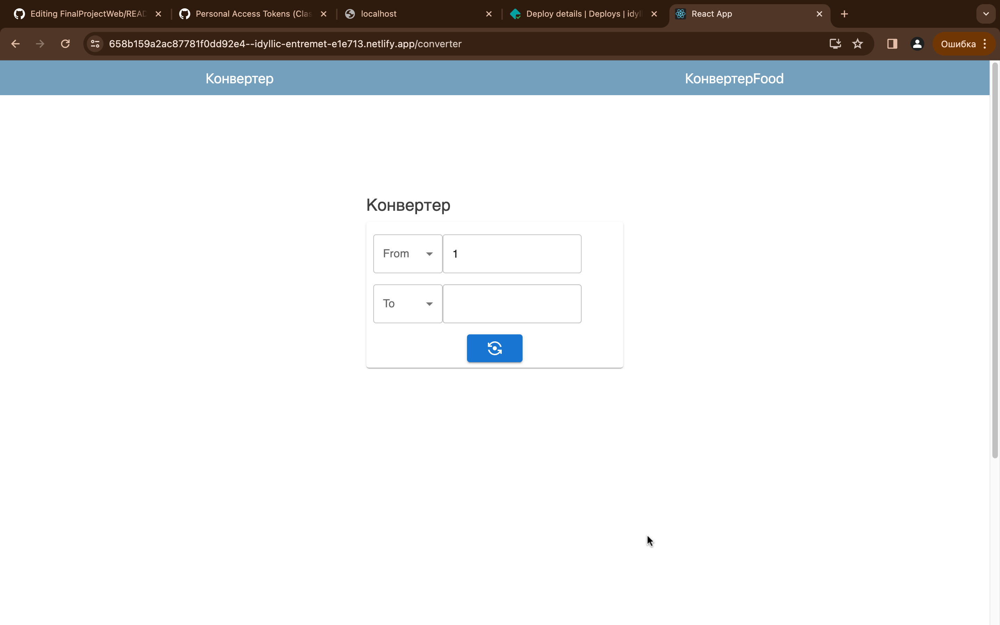

Hello!
This is my project for Final!
its simple web-app, Currency Converter and additionaly converter of food.

To start tihs project, just write this commands

```
npm i
npm start
```

# deployed web-app [https://658b159a2ac87781f0dd92e4--idyllic-entremet-e1e713.netlify.app/foodConverter](https://658b159a2ac87781f0dd92e4--idyllic-entremet-e1e713.netlify.app/)

[Currency Converter App video](https://youtu.be/2vFcIZIxIww)

scrrenshots are here ->




